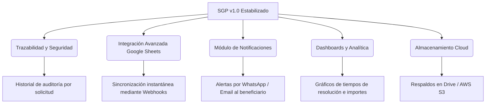

# Reporte de Producto y Propuestas de Mejora: SGP (Sistema de Gestión de Proyectos)
**Versión:** 1.0 (Lanzamiento y Estabilización)
**Idioma:** Español (Regla Global 1)

Este documento presenta una síntesis de las funcionalidades entregadas hasta la fecha para el Sistema de Gestión de Proyectos (SGP), los resultados de la suite de regresión y las propuestas de mejora sugeridas para evolucionar el producto en futuras fases de desarrollo.

---

## 1. Resumen de Funcionalidades Entregadas

El sistema se encuentra operativo y cuenta con una arquitectura robusta basada en Spring Boot (Backend) y React (Frontend). Las funcionalidades clave estabilizadas son:

### A. Gestión de Usuarios y Roles
*   **Perfiles de Acceso**: Operador, Distribuidor, Responsable, Resolutor (específico por área), Lector (Auditor) y Administrador.
*   **Formularios de Configuración**: Modal interactivo de alta y edición de usuarios, con control dinámico de asignación de múltiples roles por casillas de verificación (checkboxes).

### B. Formato de Carga Dinámica (Nivel 2)
*   **Campos Dinámicos**: Carga adaptada a tipos de solicitudes. Al iniciar una solicitud de tipo `SUBSIDIO`, el sistema exige campos obligatorios como DNI, Dirección de DNI, DNI frente, DNI dorso y Constancia de CBU.
*   **Carga de Archivos**: Componente de subida de evidencias y documentos adjuntos de forma segura (archivos PDF, TXT e imágenes).

### C. Flujo de Resoluciones e Integración Externa
*   **Resolutor de Subsidio (Google Sheets)**:
    *   Exportación selectiva y total de solicitudes en estado `Consideración` hacia una planilla externa de Google Sheets.
    *   Mecanismo de sincronización automatizado (`SyncService`) que lee la planilla externa y procesa los importes modificados:
        *   **Monto mayor a cero**: Aprobada (transiciona a `Resueltas`).
        *   **Monto igual a cero**: Rechazada (transiciona a `Rechazado`).
        *   **Monto menor a cero o vacío**: En evaluación (permanece en `Consideración`).
*   **Resolutor de Agenda (Formulario Interno)**:
    *   Completado de atributos dinámicos directamente en el panel web (Fecha, Declaración de interés, Observaciones).
    *   Selector de Asistencia obligatorio (`Con Asistencia` / `Sin Asistencia`) y botón de confirmación integrado (`Confirmar y Finalizar`).
*   **Doble Aprobación Transversal**:
    *   Permite asociar múltiples asignaciones independientes a una misma solicitud (ej. OTRA y AGENDA).
    *   La solicitud sólo cambia al estado final de `"Resueltas"` cuando todos los resolutores asignados confirman la aprobación de su área correspondiente de forma secuencial o en paralelo.

---

## 2. Resultados de las Pruebas de Regresión Locales (100% Exitosas)

Se ejecutaron localmente con éxito absoluto dos suites principales de pruebas de Playwright sobre el entorno de desarrollo H2:

1.  **Reglas de Negocio de Subsidios (`etapa10_pruebas_locales.spec.js`)**:
    *   *Resultado*: ✅ **APROBADO** (1 passed, 1.3m).
    *   *Verificación*: Se simularon los 4 casos de negocio de importación desde Google Sheets (monto positivo, cero, negativo y vacío), confirmando la correcta transición de estados de las solicitudes sin dejar endpoints de diagnóstico activos en el backend de producción.
2.  **Doble Aprobación y Agenda (`flujo_doble_resolutor.spec.js`)**:
    *   *Resultado*: ✅ **APROBADO** (1 passed, 46.2s).
    *   *Verificación*: Se simuló el registro dinámico de un segundo resolutor, la asignación simultánea de resoluciones tipo `OTRA` y `AGENDA` a una solicitud, la subida de adjuntos y la aprobación digital por parte de ambos resolutores, culminando en la transición automática del estado a `Resueltas`.

---

## 3. Propuestas de Mejora y Nuevas Ideas de Producto

Para potenciar el valor del producto de cara al cliente final y mejorar el flujo operativo del sistema, se proponen las siguientes iniciativas técnicas y funcionales:

### 1. Auditoría y Trazabilidad de Cambios
*   **Objetivo**: Generar confianza absoluta y evitar discrepancias entre lo cargado y lo modificado.
*   **Propuesta**: Implementar una sección de "Historial de Cambios" dentro del detalle de cada solicitud. Cada vez que un Operador, Responsable o Resolutor modifique un campo o firme una aprobación, se registrará el usuario, fecha, hora y el valor anterior/nuevo de forma inmutable en la base de datos.

### 2. Sincronización en Tiempo Real mediante Webhooks (Google Sheets)
*   **Objetivo**: Eliminar las esperas de sincronización por parte del Resolutor.
*   **Propuesta**: Reemplazar el mecanismo de polling por un Google Apps Script asociado a la planilla externa. Cuando un revisor modifique un importe en la planilla, la hoja de cálculo enviará una petición HTTP POST instantánea (Webhook) al backend del SGP para actualizar la base de datos en tiempo real.

### 3. Validaciones de Datos en la Planilla de Entrada
*   **Objetivo**: Evitar errores humanos en la planilla que puedan romper la sincronización.
*   **Propuesta**: Aplicar reglas de validación de celdas en Google Sheets utilizando Apps Script para que sólo se puedan ingresar valores numéricos y se bloquee la edición de columnas críticas (como el ID o el Nombre del solicitante).

### 4. Módulo Automático de Notificaciones al Beneficiario
*   **Objetivo**: Mejorar la comunicación con los solicitantes y reducir consultas manuales.
*   **Propuesta**: Integrar una API de mensajería (como Twilio para WhatsApp o SMS, o un servidor SMTP de producción) para enviar un aviso automático al solicitante (ej: *"Su solicitud de Subsidio #123 ha sido aprobada por un monto de $95.000"*).

### 5. Dashboards Ejecutivos y Analíticos
*   **Objetivo**: Proveer información clave para la toma de decisiones.
*   **Propuesta**: Crear un panel visual interactivo para los Administradores y Distribuidores que incluya:
    *   Monto total aprobado vs. presupuestado.
    *   Tiempos promedio de resolución por tipo de área (Agenda vs. Subsidios).
    *   Mapas o gráficos de barras por zona territorial (Norte, Sur, Centro) y barrios con más demandas.

### 6. Almacenamiento Centralizado en la Nube
*   **Objetivo**: Garantizar backups y evitar ocupar espacio en disco local del VPS.
*   **Propuesta**: Configurar la subida de adjuntos (PDFs, CBU, imágenes) directamente a un bucket de Amazon S3 o una carpeta segura de Google Drive asociada al proyecto.
